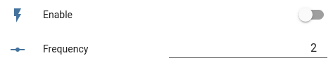

# Control any arduino program with ESPHome

In this guide you will learn how to convert any classic arduino program to a custom ESPHome component. For this we will use an advanced blink sketch which has two global variables. The `enable` variable to turn the blinking on and off and the `frequency` variable to control the blinking speed. Both variables are fixed in the arduino code. With the help of ESPHome, we want to change these variables via Home Assistant.

To follow the guide, you should know/read the following:
- how to write arduino programs
- how to create and build your own ESPHome configurations
- [ESPHomes custom sensor article](https://esphome.io/components/sensor/custom.html)


This is the arduino code we start with:
```c++
#define LED_PIN 2

unsigned long last_led_change;
bool enable = false;
float frequency = 1;

void setup()
{
  pinMode(LED_PIN, OUTPUT);
  last_led_change = millis();
}

void loop()
{
  if (enable == false)
  {
    return;
  }

  unsigned long now = millis();
  
  if (last_led_change + 1000 / frequency  < now)
  {
    digitalWrite(LED_PIN, !digitalRead(LED_PIN));
    last_led_change = now;
  }
}
```

The full arduino code can be found in the folder `arduinoCode`. 

## Convert to ESPHome

ESPHome can be extended with the help of [CustomComponents](https://esphome.io/custom/custom_component.html). A custom component has a setup and a loop function which are called regular by ESPHome. We use a custom component to run our blink code. To control the `enable` and `frequency` variables, we create a [template number](https://esphome.io/components/number/template.html) and a [template switch](https://esphome.io/components/switch/template.html) entry in our YAML. This will create two entities in Home Assistant where we can set the values.
```yaml
number:
  - platform: template
    name: "Frequency"
    id: blink_frequency
    optimistic: true
    min_value: 0.1
    max_value: 100
    step: 0.1
    restore_value: true

switch:
  - platform: template
    name: "Enable"
    id: blink_enable
    optimistic: true
    restore_state: true
```

When we create a CustomComponent we need to create a code file and register the Component in the config YAML. During the registration we can pass references to the switch and number inputs:

```yaml
esphome:
    [...]
    includes:
    - advancedBlinkComponent.h

custom_component:
- lambda: |-
    auto myComponent = new AdvancedBlinkComponent(id(blink_enable), id(blink_frequency));
    return {myComponent};

```


The next step is to create the file `advancedBlinkComponent.h` next to the YAML file with the following content:
```c++
#include "esphome.h"

#define LED_PIN 2

class AdvancedBlinkComponent : public Component
{
public:
  unsigned long last_led_change;
  bool enable = false;
  float frequency = 1;

  AdvancedBlinkComponent(esphome::template_::TemplateSwitch *&_enable, esphome::template_::TemplateNumber *&_frequency)
  {
    _enable->add_on_state_callback([this](bool newState)
                                   { enable = newState; });
    _frequency->add_on_state_callback([this](float newFrequency)
                                      { frequency = newFrequency; });
  }

  void setup() override
  {
    pinMode(LED_PIN, OUTPUT);
    last_led_change = millis();
  }

  void loop() override
  {
    if (enable == false)
    {
      return;
    }

    unsigned long now = millis();

    if (last_led_change + 1000 / frequency  < now)
    {
      digitalWrite(LED_PIN, !digitalRead(LED_PIN));
      last_led_change = now;
    }
  }
};
```

We use the `add_on_state_callback` function on the passed inputs to set our variables whenever a new value is received by ESPHome. The rest of the code is unchanged but wrapped in a new class which extends the ESPHome Component class. The complete ESPHome project is in the folder `esphome`

When everything is compiled and uploaded, you can now add the device to Home Assistant and you should see these controls:




